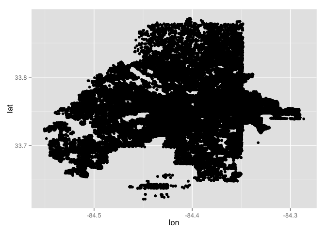
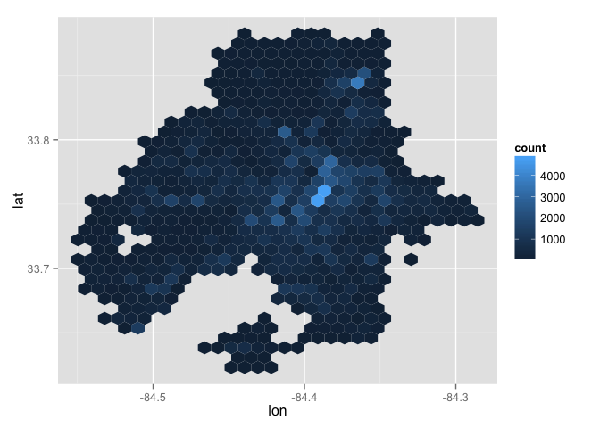
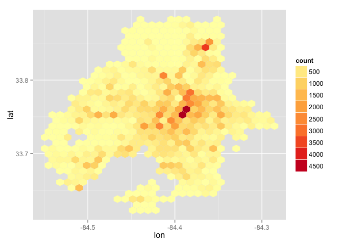
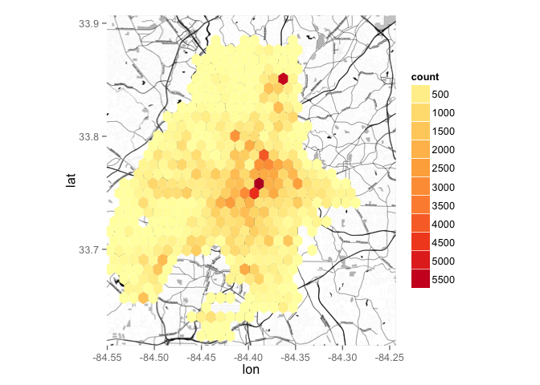
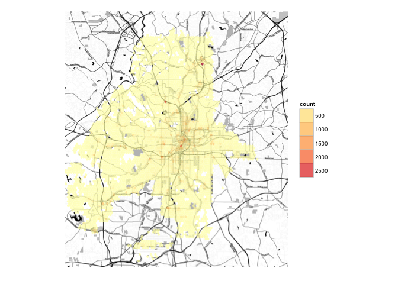
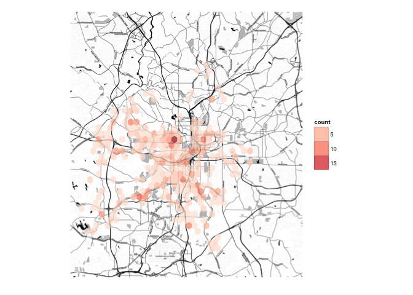

# rdemo
Short R demonstration for SHINE Fellows

Matt  
October 11, 2015  


```r
# Uncomment the code for the first time you download the data:
# create a temporary file to store our downloaded crime data
# tmp<-tempfile()

# go to http://www.atlantapd.org/crimedatadownloads.aspx to find latest file path
# they change it each time they uplaod new data
# crimeURL<-"http://www.atlantapd.org/pdf/crime-data-downloads/85FB2BA9-E419-489A-8079-4ACEB419D937.zip"

# download file, unzip
# download.file(crimeURL,tmp)
# crimefile<-unzip(tmp, list=TRUE)
# crimeatl <- read.csv(unz(tmp, crimefile[1]))
# write.csv(crimeatl, "Desktop/crimeatl.csv", row.names=FALSE)
# if you prefer to download and unzip the file manually, can just use read.csv()

crimeatl<-read.csv("~/Desktop/crimeatl.csv", header=TRUE)

dim(crimeatl)
```

```
## [1] 230779     23
```

```r
summary(crimeatl)
```

```
##                      MI_PRINX        offense_id        
##  -84.36061               :     1   Min.   :-8.500e+01  
##  -84.37037               :     1   1st Qu.: 1.020e+08  
##  -84.39575               :     1   Median : 1.206e+08  
##  -84.39589               :     1   Mean   : 4.248e+08  
##  -84.47724               :     1   3rd Qu.: 1.333e+08  
##  (230758 row(s) affected):     1   Max.   : 1.527e+11  
##  (Other)                 :230773   NA's   :15          
##                            rpt_date     
##  11/17/2009                    :   171  
##  06/01/2009                    :   155  
##  08/29/2011                    :   155  
##  07/14/2009                    :   154  
##  07/27/2009                    :   152  
##  06/29/2009                    :   151  
##  (Other)                       :229841  
##                           occur_date    
##  08/01/2011                    :   158  
##  08/05/2009                    :   152  
##  12/04/2009                    :   152  
##  05/22/2009                    :   151  
##  11/17/2009                    :   150  
##  01/26/2009                    :   146  
##  (Other)                       :229870  
##                           occur_time    
##  12:00:00                      :  8819  
##  18:00:00                      :  6950  
##  20:00:00                      :  6677  
##  22:00:00                      :  6465  
##  17:00:00                      :  6355  
##  23:00:00                      :  6190  
##  (Other)                       :189323  
##                           poss_date     
##  11/17/2009                    :   167  
##  07/27/2009                    :   157  
##  01/02/2009                    :   148  
##  01/26/2009                    :   148  
##  06/09/2009                    :   147  
##  08/01/2011                    :   147  
##  (Other)                       :229865  
##                           poss_time           beat       apt_office_prefix
##  08:00:00                      :  5178   Min.   : 50.0   NULL   :223251   
##  12:00:00                      :  4991   1st Qu.:208.0   APT    :  3690   
##  09:00:00                      :  4215   Median :401.0   B      :   257   
##  15:00:00                      :  4027   Mean   :359.7   A      :   213   
##  07:00:00                      :  4000   3rd Qu.:506.0   D      :   187   
##  16:00:00                      :  3901   Max.   :902.0   STE    :   182   
##  (Other)                       :204467   NA's   :24      (Other):  2999   
##  apt_office_num                               location     
##  NULL   :181978   1801 HOWELL MILL RD NW          :  1707  
##  A      :  1536   3393 PEACHTREE RD NE            :  1674  
##  B      :  1411   2685 METROPOLITAN PKWY SW       :   801  
##  1      :   808   3393 PEACHTREE RD NE @LENOX MALL:   705  
##  2      :   802   590 CASCADE AVE SW              :   694  
##  3      :   622   1275 CAROLINE ST NE             :   609  
##  (Other): 43622   (Other)                         :224589  
##     MinOfucr     MinOfibr_code     dispo_code     MaxOfnum_victims
##  0640   :53164   2305   :53104   NULL   :202659   1      :203160  
##  0511   :29923   2202   :29904   10     : 17449   2      : 18935  
##  0710   :24428   2404   :19406   20     :  4106   3      :  3432  
##  0630   :19293   2303   :19261   50     :  3829   0      :  2127  
##  0690   :18560   2399   :17977   60     :  1733   4      :  1120  
##  0670   :12841   2308   :12807   30     :   727   NULL   :  1086  
##  (Other):72570   (Other):78320   (Other):   276   (Other):   919  
##      Shift          Avg.Day         loc_type    
##  Eve    :74866   Sat    :31292   20     :50448  
##  Morn   :61208   Fri    :30728   18     :44802  
##  Day    :58025   Tue    :30565   13     :29183  
##  Unk    :36639   Wed    :29770   26     :26864  
##         :   21   Mon    :29668   NULL   :22197  
##  1      :   11   Thu    :29653   99     : 7094  
##  (Other):    9   (Other):49103   (Other):50191  
##                UC2.Literal             neighborhood         npu        
##  LARCENY-FROM VEHICLE:63712   Downtown       : 17117   M      : 28434  
##  LARCENY-NON VEHICLE :55533   Midtown        : 11931   E      : 21618  
##  BURGLARY-RESIDENCE  :38062   NULL           :  9888   B      : 17536  
##  AUTO THEFT          :33031   Old Fourth Ward:  7023   V      : 12386  
##  AGG ASSAULT         :16277   West End       :  5974   T      : 12035  
##  ROBBERY-PEDESTRIAN  :12372   Lenox          :  4106   R      : 10866  
##  (Other)             :11792   (Other)        :174740   (Other):127904  
##          x                 y         
##  -84.36212:  2945   33.84676:  2945  
##  -84.41278:  1768   33.80388:  1751  
##  -84.40902:   838   33.68274:   856  
##  -84.43276:   835   33.73812:   842  
##  -84.49773:   831   33.68677:   834  
##  -84.39201:   744   33.7532 :   716  
##  (Other)  :222818   (Other) :222835
```

```r
head(crimeatl)
```

```
##   MI_PRINX offense_id                       rpt_date
## 1  1160569   90360664 02/05/2009                    
## 2  1160570   90370891 02/06/2009                    
## 3  1160572   91681984 06/17/2009                    
## 4  1160573   72692336 02/24/2010                    
## 5  1160574   80081069 10/06/2010                    
## 6  1160575   82040835 02/27/2009                    
##                       occur_date                     occur_time
## 1 02/03/2009                     13:50:00                      
## 2 02/06/2009                     08:50:00                      
## 3 06/17/2009                     14:00:00                      
## 4 02/24/2010                     23:29:00                      
## 5 01/08/2008                     13:14:00                      
## 6 07/21/2008                     18:00:00                      
##                        poss_date                      poss_time beat
## 1 02/03/2009                     15:00:00                        305
## 2 02/06/2009                     10:45:00                        502
## 3 06/17/2009                     15:00:00                        604
## 4 02/24/2010                     23:30:00                        303
## 5 01/08/2008                     13:15:00                        603
## 6 07/21/2008                     18:00:00                        104
##   apt_office_prefix apt_office_num               location MinOfucr
## 1              NULL           NULL   55 MCDONOUGH BLVD SW     0670
## 2              NULL           NULL 464 ANSLEY WALK TER NW     0640
## 3              NULL            816         375 AUBURN AVE     0670
## 4              NULL           NULL          600 MARTIN ST     0420
## 5              NULL           NULL   447 ARNOLD STREET NE     0511
## 6              NULL           NULL       1721 BROWNING ST     0531
##   MinOfibr_code dispo_code MaxOfnum_victims Shift Avg.Day loc_type
## 1          2308       NULL                1   Day     Tue       35
## 2          2305       NULL                1   Day     Fri       18
## 3          2308       NULL                1   Day     Wed     NULL
## 4         1315K       NULL                1  Morn     Wed       26
## 5          2202       NULL                1   Day     Tue       20
## 6         2202A         50                1   Eve     Mon       20
##            UC2.Literal    neighborhood npu         x        y
## 1  LARCENY-NON VEHICLE   South Atlanta   Y -84.38654 33.72024
## 2 LARCENY-FROM VEHICLE     Ansley Park   E -84.37276 33.79685
## 3  LARCENY-NON VEHICLE    Sweet Auburn   M -84.37521  33.7554
## 4          AGG ASSAULT      Pittsburgh   V  -84.3946 33.72212
## 5   BURGLARY-RESIDENCE Old Fourth Ward   M -84.36896 33.76658
## 6   BURGLARY-RESIDENCE     Mozley Park   K -84.44342 33.75265
```

```r
table(crimeatl$Avg.Day)
```

```
## 
##           1   Day   Eve   Fri   Mon  Morn  NULL   Sat   Sun   Thu   Tue 
##    21     5     4     3 30728 29668     3     1 31292 27701 29653 30565 
##   Unk   Wed 
## 21365 29770
```

```r
# uncomment if this is the first time you are using these packages:       
# install.packages(c("ggplot2","ggmap","ggthemes","lubridate"))

library(ggplot2)
library(scales)
library(ggmap)
library(ggthemes)
# the "x" and "y" coordinates are factors, not numbers
summary(crimeatl[,c("x","y")])
```

```
##          x                 y         
##  -84.36212:  2945   33.84676:  2945  
##  -84.41278:  1768   33.80388:  1751  
##  -84.40902:   838   33.68274:   856  
##  -84.43276:   835   33.73812:   842  
##  -84.49773:   831   33.68677:   834  
##  -84.39201:   744   33.7532 :   716  
##  (Other)  :222818   (Other) :222835
```

```r
# convert them to numeric
crimeatl$lon<-as.numeric(as.character(crimeatl$x))
```

```
## Warning: NAs introduced by coercion
```

```r
crimeatl$lat<-as.numeric(as.character(crimeatl$y))
```

```
## Warning: NAs introduced by coercion
```

```r
# still a problem, there might be a typo-- lat of -84?
summary(crimeatl[, c("lon","lat")])
```

```
##       lon              lat        
##  Min.   :-84.55   Min.   :-84.50  
##  1st Qu.:-84.43   1st Qu.: 33.73  
##  Median :-84.40   Median : 33.76  
##  Mean   :-84.41   Mean   : 33.75  
##  3rd Qu.:-84.37   3rd Qu.: 33.78  
##  Max.   :-84.29   Max.   : 33.89  
##  NA's   :41       NA's   :27
```

```r
# we will just drop the ones that don't make sense
crimeatl<- crimeatl[ crimeatl$lat > 33, ]

# here are our datapoints:
ggplot(data=crimeatl, aes(x=lon, y=lat)) + geom_point()
```

```
## Warning: Removed 27 rows containing missing values (geom_point).
```

 

```r
# hexbins help reduce overplotting
ggplot(data=crimeatl, aes(x=lon, y=lat)) + geom_hex()
```

```
## Warning: Removed 27 rows containing missing values (stat_hexbin).
```

 

```r
# we can add a map projection, to fix the aspect ratio:
ggplot(data=crimeatl, aes(x=lon, y=lat)) + geom_hex()+
  scale_fill_distiller(palette="YlOrRd", breaks=pretty_breaks(n=10))
```

```
## Warning: Removed 27 rows containing missing values (stat_hexbin).
```

 

```r
# figure out map dimensions:
r.lon <- range(crimeatl$lon, na.rm=TRUE)
r.lat <- range(crimeatl$lat, na.rm=TRUE)
bounds<-c(r.lon[1], r.lat[1], r.lon[2], r.lat[2])

# get the map tiles
atl.map <- get_map(location=bounds, maptype = "toner", zoom=13, crop=FALSE)
```

```
## maptype = "toner" is only available with source = "stamen".
## resetting to source = "stamen"...
## 56 tiles needed, this may take a while (try a smaller zoom).
## Map from URL : http://tile.stamen.com/toner/13/2172/3275.png
## Map from URL : http://tile.stamen.com/toner/13/2173/3275.png
## Map from URL : http://tile.stamen.com/toner/13/2174/3275.png
## Map from URL : http://tile.stamen.com/toner/13/2175/3275.png
## Map from URL : http://tile.stamen.com/toner/13/2176/3275.png
## Map from URL : http://tile.stamen.com/toner/13/2177/3275.png
## Map from URL : http://tile.stamen.com/toner/13/2178/3275.png
## Map from URL : http://tile.stamen.com/toner/13/2172/3276.png
## Map from URL : http://tile.stamen.com/toner/13/2173/3276.png
## Map from URL : http://tile.stamen.com/toner/13/2174/3276.png
## Map from URL : http://tile.stamen.com/toner/13/2175/3276.png
## Map from URL : http://tile.stamen.com/toner/13/2176/3276.png
## Map from URL : http://tile.stamen.com/toner/13/2177/3276.png
## Map from URL : http://tile.stamen.com/toner/13/2178/3276.png
## Map from URL : http://tile.stamen.com/toner/13/2172/3277.png
## Map from URL : http://tile.stamen.com/toner/13/2173/3277.png
## Map from URL : http://tile.stamen.com/toner/13/2174/3277.png
## Map from URL : http://tile.stamen.com/toner/13/2175/3277.png
## Map from URL : http://tile.stamen.com/toner/13/2176/3277.png
## Map from URL : http://tile.stamen.com/toner/13/2177/3277.png
## Map from URL : http://tile.stamen.com/toner/13/2178/3277.png
## Map from URL : http://tile.stamen.com/toner/13/2172/3278.png
## Map from URL : http://tile.stamen.com/toner/13/2173/3278.png
## Map from URL : http://tile.stamen.com/toner/13/2174/3278.png
## Map from URL : http://tile.stamen.com/toner/13/2175/3278.png
## Map from URL : http://tile.stamen.com/toner/13/2176/3278.png
## Map from URL : http://tile.stamen.com/toner/13/2177/3278.png
## Map from URL : http://tile.stamen.com/toner/13/2178/3278.png
## Map from URL : http://tile.stamen.com/toner/13/2172/3279.png
## Map from URL : http://tile.stamen.com/toner/13/2173/3279.png
## Map from URL : http://tile.stamen.com/toner/13/2174/3279.png
## Map from URL : http://tile.stamen.com/toner/13/2175/3279.png
## Map from URL : http://tile.stamen.com/toner/13/2176/3279.png
## Map from URL : http://tile.stamen.com/toner/13/2177/3279.png
## Map from URL : http://tile.stamen.com/toner/13/2178/3279.png
## Map from URL : http://tile.stamen.com/toner/13/2172/3280.png
## Map from URL : http://tile.stamen.com/toner/13/2173/3280.png
## Map from URL : http://tile.stamen.com/toner/13/2174/3280.png
## Map from URL : http://tile.stamen.com/toner/13/2175/3280.png
## Map from URL : http://tile.stamen.com/toner/13/2176/3280.png
## Map from URL : http://tile.stamen.com/toner/13/2177/3280.png
## Map from URL : http://tile.stamen.com/toner/13/2178/3280.png
## Map from URL : http://tile.stamen.com/toner/13/2172/3281.png
## Map from URL : http://tile.stamen.com/toner/13/2173/3281.png
## Map from URL : http://tile.stamen.com/toner/13/2174/3281.png
## Map from URL : http://tile.stamen.com/toner/13/2175/3281.png
## Map from URL : http://tile.stamen.com/toner/13/2176/3281.png
## Map from URL : http://tile.stamen.com/toner/13/2177/3281.png
## Map from URL : http://tile.stamen.com/toner/13/2178/3281.png
## Map from URL : http://tile.stamen.com/toner/13/2172/3282.png
## Map from URL : http://tile.stamen.com/toner/13/2173/3282.png
## Map from URL : http://tile.stamen.com/toner/13/2174/3282.png
## Map from URL : http://tile.stamen.com/toner/13/2175/3282.png
## Map from URL : http://tile.stamen.com/toner/13/2176/3282.png
## Map from URL : http://tile.stamen.com/toner/13/2177/3282.png
## Map from URL : http://tile.stamen.com/toner/13/2178/3282.png
```

```r
# create the map
ggmap(atl.map) + 
  geom_hex(data=crimeatl, aes(x=lon, y=lat)) +
  scale_fill_distiller(palette="YlOrRd", breaks=pretty_breaks(n=10))
```

```
## Warning: Removed 27 rows containing missing values (stat_hexbin).
```

 

```r
#remove the lat/lon marks, add transparency, change number of bins
ggmap(atl.map) + 
  geom_hex(data=crimeatl, aes(x=lon, y=lat), alpha=.7, bins=100) +
  scale_fill_distiller(palette="YlOrRd", breaks=pretty_breaks(n=10))+
  theme_map()+theme(legend.position="right")
```

```
## Warning: Removed 27 rows containing missing values (stat_hexbin).
```

 

```r
# just look at homicide
murderatl<- crimeatl[ crimeatl$UC2.Literal == "HOMICIDE",]

# are the number of homicides increasing or decreasing over time?
library(lubridate)
murderatl$murderdate<-mdy(murderatl$occur_date)
murderatl$murderyear<-year(murderatl$murderdate)

table(murderatl$murderyear)
```

```
## 
## 2001 2006 2007 2008 2009 2010 2011 2012 2013 2014 2015 
##    1    2    2    2   76   88   88   82   83   92   69
```

```r
# but we are only through week 40 of 2015 -- how does that project?
69/(40/52)
```

```
## [1] 89.7
```

```r
murderatl$murdermonth<-month(murderatl$murderdate)
table(murderatl$murderyear, murderatl$murdermonth)
```

```
##       
##         1  2  3  4  5  6  7  8  9 10 11 12
##   2001  0  0  0  0  0  0  0  1  0  0  0  0
##   2006  0  0  0  1  0  0  1  0  0  0  0  0
##   2007  0  1  0  0  0  0  0  1  0  0  0  0
##   2008  0  0  0  1  0  0  0  0  1  0  0  0
##   2009  6  9  5  5  9  9  7  6  4  8  1  7
##   2010  5  4  9  9  6  6  7 10 11  9  6  6
##   2011  6  3  6  7  8 11  7  4  8  7 10 11
##   2012  5  3 10  5  5  9  8  8  6 10  8  5
##   2013  7  7  3  6  7  7  8  9  5  7 10  7
##   2014  6  1 12  4  4 12  8  8 10  9 12  6
##   2015  6  8  5  8 11  5 14  4  7  1  0  0
```

```r
ggmap(atl.map) + 
  geom_hex(data=murderatl, aes(x=lon, y=lat), alpha=.7, bins=40) +
  scale_fill_distiller(palette="Reds")+
  theme_map()+theme(legend.position="right")
```

```
## Warning: Removed 27 rows containing missing values (stat_hexbin).
```

 
